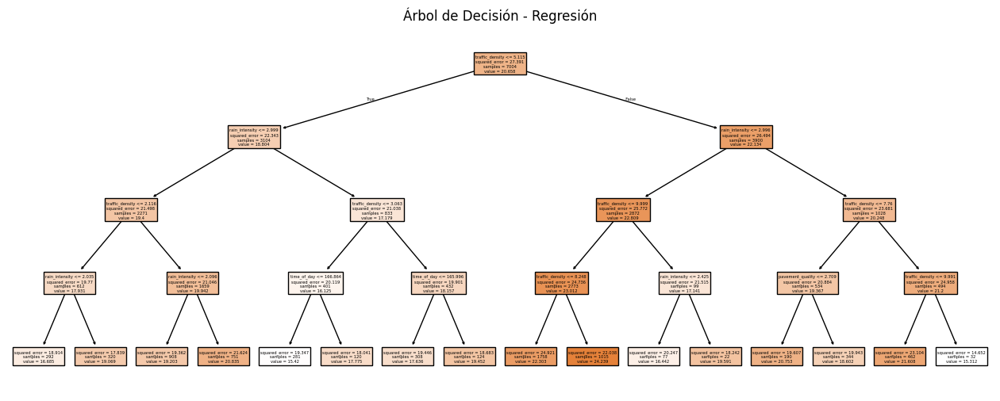

# Predicción de Accidentes de Tránsito con Minería de Datos

Este proyecto corresponde al trabajo final del curso Minería de Datos, donde se aplicaron técnicas de análisis, modelado y visualización para predecir la cantidad de accidentes de tránsito bajo distintas condiciones urbanas, climáticas y viales.

## Objetivo

Demostrar cómo un modelo de regresión puede identificar factores de riesgo que aumentan la probabilidad de accidentes, transformando los resultados en una narrativa visual y comprensible.

## Modelo aplicado

Se utilizó un árbol de decisión (DecisionTreeRegressor) ajustado con GridSearchCV, trabajando sobre variables como:

- Densidad de tráfico
- Intensidad de lluvia
- Calidad del pavimento
- Multas de tránsito
- Velocidad promedio y otras

## Visualizaciones

Aquí algunas de las visualizaciones que sustentan nuestros insights:

### Variables más influyentes

### Impácto de la densidad del tráfico en los accidentes

## Micrositio público (Storytelling)

Puedes ver el micrositio con los insights y visualizaciones en el siguiente enlace:  
https://diegofernandezb.github.io/accidents-storytelling/
